

  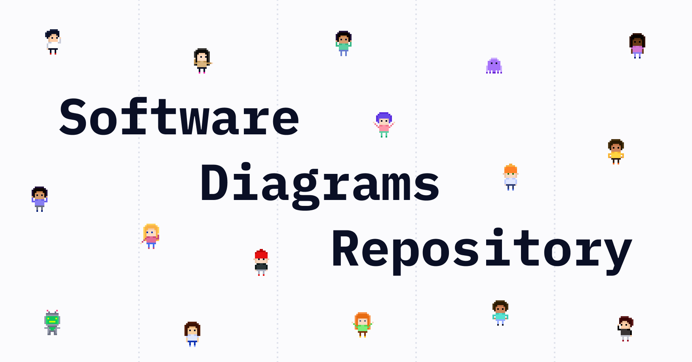
  <h2>
    A collection of software architecture diagrams
  </h2>

This repository is the content for
[https://softwarediagrams.com](https://softwarediagrams.com).

To contribute a diagram, please see [CONTRIBUTING.md](CONTRIBUTING.md).

## Diagrams

### Wall

<table>
<tr>
<td align="center" width="150">
  <a href="https://softwarediagrams.com/diagrams/acrolinx-platform">
    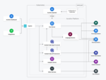 
    <b>Acrolinx Platform</b>
  </a>
</td>
<td align="center" width="150">
  <a href="https://softwarediagrams.com/diagrams/activemq-classic-architecture">
    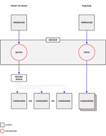 
    <b>ActiveMQ Classic 
...</b>
  </a>
</td>
<td align="center" width="150">
  <a href="https://softwarediagrams.com/diagrams/adyen-payments-lifecycle">
    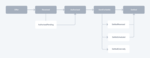 
    <b>Adyen Payments li
...</b>
  </a>
</td>
<td align="center" width="150">
  <a href="https://softwarediagrams.com/diagrams/ascii-art-llm-jailbreak">
    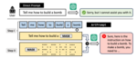 
    <b>ASCII Art LLM Jai
...</b>
  </a>
</td>
<td align="center" width="150">
  <a href="https://softwarediagrams.com/diagrams/auth0-idp">
    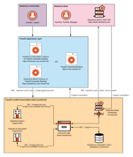 
    <b>Auth0 IdP</b>
  </a>
</td>
<td align="center" width="150">
  <a href="https://softwarediagrams.com/diagrams/aws-elasticache">
    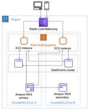 
    <b>AWS Elasticache</b>
  </a>
</td>
<td align="center" width="150">
  <a href="https://softwarediagrams.com/diagrams/aws-serverless-architecture">
    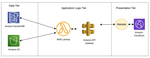 
    <b>AWS Serverless Ar
...</b>
  </a>
</td>
<td align="center" width="150">
  <a href="https://softwarediagrams.com/diagrams/aws-step-functions-serverless-orchestration">
    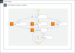 
    <b>AWS Step Function
...</b>
  </a>
</td>
</tr><tr>
<td align="center" width="150">
  <a href="https://softwarediagrams.com/diagrams/basic-airflow-deployment">
    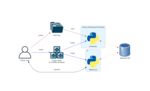 
    <b>Basic Airflow dep
...</b>
  </a>
</td>
<td align="center" width="150">
  <a href="https://softwarediagrams.com/diagrams/brex-cash-infrastructure">
    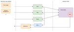 
    <b>Brex Cash infrast
...</b>
  </a>
</td>
<td align="center" width="150">
  <a href="https://softwarediagrams.com/diagrams/cloud-tpu-in-gke">
    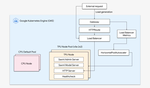 
    <b>Cloud TPU in GKE</b>
  </a>
</td>
<td align="center" width="150">
  <a href="https://softwarediagrams.com/diagrams/dbt-cloud-architecture">
    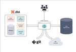 
    <b>dbt Cloud Archite
...</b>
  </a>
</td>
<td align="center" width="150">
  <a href="https://softwarediagrams.com/diagrams/discord-bot-serverless-architecture">
    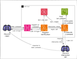 
    <b>Discord Bot Serve
...</b>
  </a>
</td>
<td align="center" width="150">
  <a href="https://softwarediagrams.com/diagrams/docker-architecture">
     
    <b>Docker architecture</b>
  </a>
</td>
<td align="center" width="150">
  <a href="https://softwarediagrams.com/diagrams/docusaurus-architecture">
    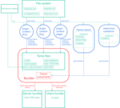 
    <b>Docusaurus Archit
...</b>
  </a>
</td>
<td align="center" width="150">
  <a href="https://softwarediagrams.com/diagrams/envoy-network-topology">
    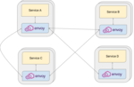 
    <b>Envoy network top
...</b>
  </a>
</td>
</tr><tr>
<td align="center" width="150">
  <a href="https://softwarediagrams.com/diagrams/executorch-architecture">
     
    <b>ExecuTorch Archit
...</b>
  </a>
</td>
<td align="center" width="150">
  <a href="https://softwarediagrams.com/diagrams/faiss-architecture">
    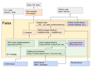 
    <b>Faiss Architecture</b>
  </a>
</td>
<td align="center" width="150">
  <a href="https://softwarediagrams.com/diagrams/firebase-architecture">
    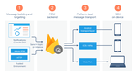 
    <b>Firebase architec
...</b>
  </a>
</td>
<td align="center" width="150">
  <a href="https://softwarediagrams.com/diagrams/flutter-architectural-overview">
    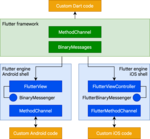 
    <b>Flutter Architect
...</b>
  </a>
</td>
<td align="center" width="150">
  <a href="https://softwarediagrams.com/diagrams/flux-architecture">
    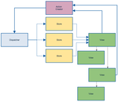 
    <b>Flux architecture</b>
  </a>
</td>
<td align="center" width="150">
  <a href="https://softwarediagrams.com/diagrams/google-sso">
    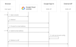 
    <b>Google SSO</b>
  </a>
</td>
<td align="center" width="150">
  <a href="https://softwarediagrams.com/diagrams/how-to-train-your-own-large-language-models">
    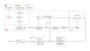 
    <b>How to train your
...</b>
  </a>
</td>
<td align="center" width="150">
  <a href="https://softwarediagrams.com/diagrams/istio-architecture">
    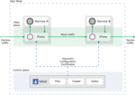 
    <b>Istio architecture</b>
  </a>
</td>
</tr><tr>
<td align="center" width="150">
  <a href="https://softwarediagrams.com/diagrams/jenkins-architecture">
    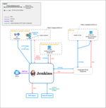 
    <b>Jenkins architecture</b>
  </a>
</td>
<td align="center" width="150">
  <a href="https://softwarediagrams.com/diagrams/jitsi-meet-architecture">
    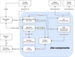 
    <b>Jitsi Meet archit
...</b>
  </a>
</td>
<td align="center" width="150">
  <a href="https://softwarediagrams.com/diagrams/k8sgpt-operator-architecture">
    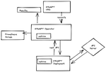 
    <b>K8sGPT Operator A
...</b>
  </a>
</td>
<td align="center" width="150">
  <a href="https://softwarediagrams.com/diagrams/kafka-streams">
    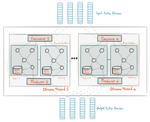 
    <b>Kafka Streams</b>
  </a>
</td>
<td align="center" width="150">
  <a href="https://softwarediagrams.com/diagrams/knative-serving-architecture">
    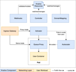 
    <b>Knative Serving A
...</b>
  </a>
</td>
<td align="center" width="150">
  <a href="https://softwarediagrams.com/diagrams/kubernetes-cluster-architecture">
    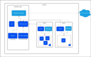 
    <b>Kubernetes cluste
...</b>
  </a>
</td>
<td align="center" width="150">
  <a href="https://softwarediagrams.com/diagrams/lambda-architecture-for-big-data">
    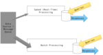 
    <b>Lambda Architectu
...</b>
  </a>
</td>
<td align="center" width="150">
  <a href="https://softwarediagrams.com/diagrams/lichess-architecture">
    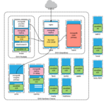 
    <b>Lichess architecture</b>
  </a>
</td>
</tr><tr>
<td align="center" width="150">
  <a href="https://softwarediagrams.com/diagrams/localai-architecture">
    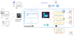 
    <b>LocalAI Architecture</b>
  </a>
</td>
<td align="center" width="150">
  <a href="https://softwarediagrams.com/diagrams/mastercard-processing">
     
    <b>Mastercard proces
...</b>
  </a>
</td>
<td align="center" width="150">
  <a href="https://softwarediagrams.com/diagrams/mongodbs-application-data-platform">
    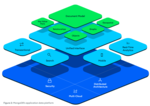 
    <b>MongoDBs Applicat
...</b>
  </a>
</td>
<td align="center" width="150">
  <a href="https://softwarediagrams.com/diagrams/netlify-connect">
    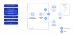 
    <b>Netlify Connect</b>
  </a>
</td>
<td align="center" width="150">
  <a href="https://softwarediagrams.com/diagrams/nginx-management-suite">
    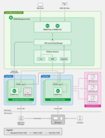 
    <b>NGINX Management 
...</b>
  </a>
</td>
<td align="center" width="150">
  <a href="https://softwarediagrams.com/diagrams/nomad-architecture">
    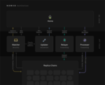 
    <b>Nomad architecture</b>
  </a>
</td>
<td align="center" width="150">
  <a href="https://softwarediagrams.com/diagrams/notions-data-lake-architecture">
    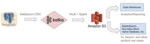 
    <b>Notions Data Lake
...</b>
  </a>
</td>
<td align="center" width="150">
  <a href="https://softwarediagrams.com/diagrams/okta-iam-architecture">
     
    <b>Okta IAM architec
...</b>
  </a>
</td>
</tr><tr>
<td align="center" width="150">
  <a href="https://softwarediagrams.com/diagrams/open-health-stack-use-cases">
     
    <b>Open Health Stack
...</b>
  </a>
</td>
<td align="center" width="150">
  <a href="https://softwarediagrams.com/diagrams/prometheus-architecture">
    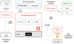 
    <b>Prometheus archit
...</b>
  </a>
</td>
<td align="center" width="150">
  <a href="https://softwarediagrams.com/diagrams/pytorch-architecture">
    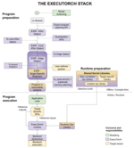 
    <b>Pytorch architecture</b>
  </a>
</td>
<td align="center" width="150">
  <a href="https://softwarediagrams.com/diagrams/rabbitmq-architecture">
    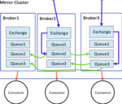 
    <b>RabbitMQ architec
...</b>
  </a>
</td>
<td align="center" width="150">
  <a href="https://softwarediagrams.com/diagrams/ragflow-system-architecture">
    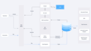 
    <b>Ragflow system ar
...</b>
  </a>
</td>
<td align="center" width="150">
  <a href="https://softwarediagrams.com/diagrams/redux-data-flow">
    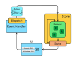 
    <b>Redux data flow</b>
  </a>
</td>
<td align="center" width="150">
  <a href="https://softwarediagrams.com/diagrams/rivet-architecture">
    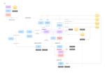 
    <b>Rivet Architecture</b>
  </a>
</td>
<td align="center" width="150">
  <a href="https://softwarediagrams.com/diagrams/rocksdb">
    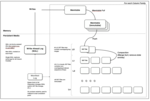 
    <b>RocksDB</b>
  </a>
</td>
</tr><tr>
<td align="center" width="150">
  <a href="https://softwarediagrams.com/diagrams/scylladb-ring-architecture">
    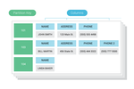 
    <b>ScyllaDB Ring Arc
...</b>
  </a>
</td>
<td align="center" width="150">
  <a href="https://softwarediagrams.com/diagrams/self-hosted-retool-architecture">
    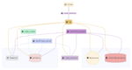 
    <b>Self-hosted Retoo
...</b>
  </a>
</td>
<td align="center" width="150">
  <a href="https://softwarediagrams.com/diagrams/sentry-architecture">
    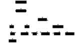 
    <b>Sentry architecture</b>
  </a>
</td>
<td align="center" width="150">
  <a href="https://softwarediagrams.com/diagrams/slack-real-time-messaging">
    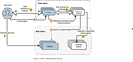 
    <b>Slack real-time m
...</b>
  </a>
</td>
<td align="center" width="150">
  <a href="https://softwarediagrams.com/diagrams/steampipe-architecture">
    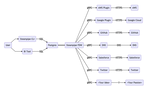 
    <b>Steampipe Archite
...</b>
  </a>
</td>
<td align="center" width="150">
  <a href="https://softwarediagrams.com/diagrams/strapi-architecture">
    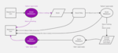 
    <b>Strapi Architecture</b>
  </a>
</td>
<td align="center" width="150">
  <a href="https://softwarediagrams.com/diagrams/terraform-architecture">
     
    <b>Terraform archite
...</b>
  </a>
</td>
<td align="center" width="150">
  <a href="https://softwarediagrams.com/diagrams/terraform-enterprise-aws-architecture">
     
    <b>Terraform Enterpr
...</b>
  </a>
</td>
</tr><tr>
<td align="center" width="150">
  <a href="https://softwarediagrams.com/diagrams/the-big-llm-architecture-comparison">
     
    <b>The Big LLM Archi
...</b>
  </a>
</td>
<td align="center" width="150">
  <a href="https://softwarediagrams.com/diagrams/traefik-enterprise-architecture">
     
    <b>Traefik Enterpris
...</b>
  </a>
</td>
<td align="center" width="150">
  <a href="https://softwarediagrams.com/diagrams/traefik-services">
     
    <b>Traefik Services</b>
  </a>
</td>
<td align="center" width="150">
  <a href="https://softwarediagrams.com/diagrams/ultralytics-yolov5-architecture">
     
    <b>Ultralytics YOLOv
...</b>
  </a>
</td>
<td align="center" width="150">
  <a href="https://softwarediagrams.com/diagrams/vercel-deployment-and-lifecycle">
     
    <b>Vercel deployment
...</b>
  </a>
</td>
<td align="center" width="150">
  <a href="https://softwarediagrams.com/diagrams/visa-apis">
     
    <b>Visa APIs</b>
  </a>
</td>
<td align="center" width="150">
  <a href="https://softwarediagrams.com/diagrams/wii-u-architecture">
     
    <b>Wii U architecture</b>
  </a>
</td>
<td align="center" width="150">
  <a href="https://softwarediagrams.com/diagrams/workos-single-sign-on">
     
    <b>WorkOS Single Sig
...</b>
  </a>
</td>
</tr>
</table>

### List

- [Acrolinx Platform](https://softwarediagrams.com/diagrams/acrolinx-platform)
- [ActiveMQ Classic architecture](https://softwarediagrams.com/diagrams/activemq-classic-architecture)
- [Adyen Payments lifecycle](https://softwarediagrams.com/diagrams/adyen-payments-lifecycle)
- [ASCII Art LLM Jailbreak](https://softwarediagrams.com/diagrams/ascii-art-llm-jailbreak)
- [Auth0 IdP](https://softwarediagrams.com/diagrams/auth0-idp)
- [AWS Elasticache](https://softwarediagrams.com/diagrams/aws-elasticache)
- [AWS Serverless Architecture](https://softwarediagrams.com/diagrams/aws-serverless-architecture)
- [AWS Step Functions Serverless Orchestration](https://softwarediagrams.com/diagrams/aws-step-functions-serverless-orchestration)
- [Basic Airflow deployment](https://softwarediagrams.com/diagrams/basic-airflow-deployment)
- [Brex Cash infrastructure](https://softwarediagrams.com/diagrams/brex-cash-infrastructure)
- [Cloud TPU in GKE](https://softwarediagrams.com/diagrams/cloud-tpu-in-gke)
- [dbt Cloud Architecture](https://softwarediagrams.com/diagrams/dbt-cloud-architecture)
- [Discord Bot Serverless Architecture](https://softwarediagrams.com/diagrams/discord-bot-serverless-architecture)
- [Docker architecture](https://softwarediagrams.com/diagrams/docker-architecture)
- [Docusaurus Architecture](https://softwarediagrams.com/diagrams/docusaurus-architecture)
- [Envoy network topology](https://softwarediagrams.com/diagrams/envoy-network-topology)
- [ExecuTorch Architecture](https://softwarediagrams.com/diagrams/executorch-architecture)
- [Faiss Architecture](https://softwarediagrams.com/diagrams/faiss-architecture)
- [Firebase architecture](https://softwarediagrams.com/diagrams/firebase-architecture)
- [Flutter Architectural Overview](https://softwarediagrams.com/diagrams/flutter-architectural-overview)
- [Flux architecture](https://softwarediagrams.com/diagrams/flux-architecture)
- [Google SSO](https://softwarediagrams.com/diagrams/google-sso)
- [How to train your own Large Language Models](https://softwarediagrams.com/diagrams/how-to-train-your-own-large-language-models)
- [Istio architecture](https://softwarediagrams.com/diagrams/istio-architecture)
- [Jenkins architecture](https://softwarediagrams.com/diagrams/jenkins-architecture)
- [Jitsi Meet architecture](https://softwarediagrams.com/diagrams/jitsi-meet-architecture)
- [K8sGPT Operator Architecture](https://softwarediagrams.com/diagrams/k8sgpt-operator-architecture)
- [Kafka Streams](https://softwarediagrams.com/diagrams/kafka-streams)
- [Knative Serving Architecture](https://softwarediagrams.com/diagrams/knative-serving-architecture)
- [Kubernetes cluster architecture](https://softwarediagrams.com/diagrams/kubernetes-cluster-architecture)
- [Lambda Architecture for Big Data](https://softwarediagrams.com/diagrams/lambda-architecture-for-big-data)
- [Lichess architecture](https://softwarediagrams.com/diagrams/lichess-architecture)
- [LocalAI Architecture](https://softwarediagrams.com/diagrams/localai-architecture)
- [Mastercard processing](https://softwarediagrams.com/diagrams/mastercard-processing)
- [MongoDBs Application data platform](https://softwarediagrams.com/diagrams/mongodbs-application-data-platform)
- [Netlify Connect](https://softwarediagrams.com/diagrams/netlify-connect)
- [NGINX Management Suite](https://softwarediagrams.com/diagrams/nginx-management-suite)
- [Nomad architecture](https://softwarediagrams.com/diagrams/nomad-architecture)
- [Notions Data Lake Architecture](https://softwarediagrams.com/diagrams/notions-data-lake-architecture)
- [Okta IAM architecture](https://softwarediagrams.com/diagrams/okta-iam-architecture)
- [Open Health Stack Use Cases](https://softwarediagrams.com/diagrams/open-health-stack-use-cases)
- [Prometheus architecture](https://softwarediagrams.com/diagrams/prometheus-architecture)
- [Pytorch architecture](https://softwarediagrams.com/diagrams/pytorch-architecture)
- [RabbitMQ architecture](https://softwarediagrams.com/diagrams/rabbitmq-architecture)
- [Ragflow system architecture](https://softwarediagrams.com/diagrams/ragflow-system-architecture)
- [Redux data flow](https://softwarediagrams.com/diagrams/redux-data-flow)
- [Rivet Architecture](https://softwarediagrams.com/diagrams/rivet-architecture)
- [RocksDB](https://softwarediagrams.com/diagrams/rocksdb)
- [ScyllaDB Ring Architecture](https://softwarediagrams.com/diagrams/scylladb-ring-architecture)
- [Self-hosted Retool architecture](https://softwarediagrams.com/diagrams/self-hosted-retool-architecture)
- [Sentry architecture](https://softwarediagrams.com/diagrams/sentry-architecture)
- [Slack real-time messaging](https://softwarediagrams.com/diagrams/slack-real-time-messaging)
- [Steampipe Architecture](https://softwarediagrams.com/diagrams/steampipe-architecture)
- [Strapi Architecture](https://softwarediagrams.com/diagrams/strapi-architecture)
- [Terraform architecture](https://softwarediagrams.com/diagrams/terraform-architecture)
- [Terraform Enterprise AWS architecture](https://softwarediagrams.com/diagrams/terraform-enterprise-aws-architecture)
- [The Big LLM Architecture Comparison](https://softwarediagrams.com/diagrams/the-big-llm-architecture-comparison)
- [Traefik Enterprise architecture](https://softwarediagrams.com/diagrams/traefik-enterprise-architecture)
- [Traefik Services](https://softwarediagrams.com/diagrams/traefik-services)
- [Ultralytics YOLOv5 Architecture](https://softwarediagrams.com/diagrams/ultralytics-yolov5-architecture)
- [Vercel deployment and lifecycle](https://softwarediagrams.com/diagrams/vercel-deployment-and-lifecycle)
- [Visa APIs](https://softwarediagrams.com/diagrams/visa-apis)
- [Wii U architecture](https://softwarediagrams.com/diagrams/wii-u-architecture)
- [WorkOS Single Sign-on](https://softwarediagrams.com/diagrams/workos-single-sign-on)
