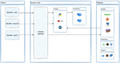
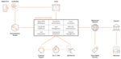
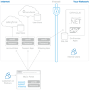
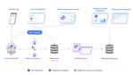
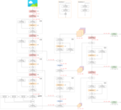

  
  <h2>
    A collection of software architecture diagrams
  </h2>

This repository is the content for
[https://softwarediagrams.com](https://softwarediagrams.com).

To contribute a diagram, please see [CONTRIBUTING.md](CONTRIBUTING.md).

## Diagrams

<table>
<tr>
<td align="center" width="150">
  <a href="https://softwarediagrams.com/diagrams/acrolinx-platform">
     
    <b>Acrolinx Platform</b>
  </a>
</td>
<td align="center" width="150">
  <a href="https://softwarediagrams.com/diagrams/activemq-classic-architecture">
     
    <b>ActiveMQ Classic 
...</b>
  </a>
</td>
<td align="center" width="150">
  <a href="https://softwarediagrams.com/diagrams/adyen-payments-lifecycle">
     
    <b>Adyen Payments li
...</b>
  </a>
</td>
<td align="center" width="150">
  <a href="https://softwarediagrams.com/diagrams/ascii-art-llm-jailbreak">
     
    <b>ASCII Art LLM Jai
...</b>
  </a>
</td>
<td align="center" width="150">
  <a href="https://softwarediagrams.com/diagrams/auth0-idp">
     
    <b>Auth0 IdP</b>
  </a>
</td>
<td align="center" width="150">
  <a href="https://softwarediagrams.com/diagrams/aws-elasticache">
     
    <b>AWS Elasticache</b>
  </a>
</td>
<td align="center" width="150">
  <a href="https://softwarediagrams.com/diagrams/basic-airflow-deployment">
     
    <b>Basic Airflow dep
...</b>
  </a>
</td>
<td align="center" width="150">
  <a href="https://softwarediagrams.com/diagrams/brex-cash-infrastructure">
     
    <b>Brex Cash infrast
...</b>
  </a>
</td>
</tr><tr>
<td align="center" width="150">
  <a href="https://softwarediagrams.com/diagrams/cloud-tpu-in-gke">
     
    <b>Cloud TPU in GKE</b>
  </a>
</td>
<td align="center" width="150">
  <a href="https://softwarediagrams.com/diagrams/dbt-cloud-architecture">
     
    <b>dbt Cloud Archite
...</b>
  </a>
</td>
<td align="center" width="150">
  <a href="https://softwarediagrams.com/diagrams/docker-architecture">
     
    <b>Docker architecture</b>
  </a>
</td>
<td align="center" width="150">
  <a href="https://softwarediagrams.com/diagrams/docusaurus-architecture">
     
    <b>Docusaurus Archit
...</b>
  </a>
</td>
<td align="center" width="150">
  <a href="https://softwarediagrams.com/diagrams/envoy-network-topology">
     
    <b>Envoy network top
...</b>
  </a>
</td>
<td align="center" width="150">
  <a href="https://softwarediagrams.com/diagrams/executorch-architecture">
     
    <b>ExecuTorch Archit
...</b>
  </a>
</td>
<td align="center" width="150">
  <a href="https://softwarediagrams.com/diagrams/faiss-architecture">
     
    <b>Faiss Architecture</b>
  </a>
</td>
<td align="center" width="150">
  <a href="https://softwarediagrams.com/diagrams/firebase-architecture">
     
    <b>Firebase architec
...</b>
  </a>
</td>
</tr><tr>
<td align="center" width="150">
  <a href="https://softwarediagrams.com/diagrams/flutter-architectural-overview">
     
    <b>Flutter Architect
...</b>
  </a>
</td>
<td align="center" width="150">
  <a href="https://softwarediagrams.com/diagrams/flux-architecture">
     
    <b>Flux architecture</b>
  </a>
</td>
<td align="center" width="150">
  <a href="https://softwarediagrams.com/diagrams/google-sso">
     
    <b>Google SSO</b>
  </a>
</td>
<td align="center" width="150">
  <a href="https://softwarediagrams.com/diagrams/how-to-train-your-own-large-language-models">
     
    <b>How to train your
...</b>
  </a>
</td>
<td align="center" width="150">
  <a href="https://softwarediagrams.com/diagrams/istio-architecture">
     
    <b>Istio architecture</b>
  </a>
</td>
<td align="center" width="150">
  <a href="https://softwarediagrams.com/diagrams/jenkins-architecture">
     
    <b>Jenkins architecture</b>
  </a>
</td>
<td align="center" width="150">
  <a href="https://softwarediagrams.com/diagrams/jitsi-meet-architecture">
     
    <b>Jitsi Meet archit
...</b>
  </a>
</td>
<td align="center" width="150">
  <a href="https://softwarediagrams.com/diagrams/k8sgpt-operator-architecture">
     
    <b>K8sGPT Operator A
...</b>
  </a>
</td>
</tr><tr>
<td align="center" width="150">
  <a href="https://softwarediagrams.com/diagrams/kafka-streams">
     
    <b>Kafka Streams</b>
  </a>
</td>
<td align="center" width="150">
  <a href="https://softwarediagrams.com/diagrams/knative-serving-architecture">
     
    <b>Knative Serving A
...</b>
  </a>
</td>
<td align="center" width="150">
  <a href="https://softwarediagrams.com/diagrams/kubernetes-cluster-architecture">
     
    <b>Kubernetes cluste
...</b>
  </a>
</td>
<td align="center" width="150">
  <a href="https://softwarediagrams.com/diagrams/lichess-architecture">
     
    <b>Lichess architecture</b>
  </a>
</td>
<td align="center" width="150">
  <a href="https://softwarediagrams.com/diagrams/localai-architecture">
     
    <b>LocalAI Architecture</b>
  </a>
</td>
<td align="center" width="150">
  <a href="https://softwarediagrams.com/diagrams/mastercard-processing">
     
    <b>Mastercard proces
...</b>
  </a>
</td>
<td align="center" width="150">
  <a href="https://softwarediagrams.com/diagrams/mongodbs-application-data-platform">
     
    <b>MongoDBs Applicat
...</b>
  </a>
</td>
<td align="center" width="150">
  <a href="https://softwarediagrams.com/diagrams/netlify-connect">
     
    <b>Netlify Connect</b>
  </a>
</td>
</tr><tr>
<td align="center" width="150">
  <a href="https://softwarediagrams.com/diagrams/nginx-management-suite">
     
    <b>NGINX Management 
...</b>
  </a>
</td>
<td align="center" width="150">
  <a href="https://softwarediagrams.com/diagrams/nomad-architecture">
     
    <b>Nomad architecture</b>
  </a>
</td>
<td align="center" width="150">
  <a href="https://softwarediagrams.com/diagrams/okta-iam-architecture">
     
    <b>Okta IAM architec
...</b>
  </a>
</td>
<td align="center" width="150">
  <a href="https://softwarediagrams.com/diagrams/open-health-stack-use-cases">
     
    <b>Open Health Stack
...</b>
  </a>
</td>
<td align="center" width="150">
  <a href="https://softwarediagrams.com/diagrams/prometheus-architecture">
     
    <b>Prometheus archit
...</b>
  </a>
</td>
<td align="center" width="150">
  <a href="https://softwarediagrams.com/diagrams/pytorch-architecture">
     
    <b>Pytorch architecture</b>
  </a>
</td>
<td align="center" width="150">
  <a href="https://softwarediagrams.com/diagrams/rabbitmq-architecture">
     
    <b>RabbitMQ architec
...</b>
  </a>
</td>
<td align="center" width="150">
  <a href="https://softwarediagrams.com/diagrams/ragflow-system-architecture">
     
    <b>Ragflow system ar
...</b>
  </a>
</td>
</tr><tr>
<td align="center" width="150">
  <a href="https://softwarediagrams.com/diagrams/redux-data-flow">
     
    <b>Redux data flow</b>
  </a>
</td>
<td align="center" width="150">
  <a href="https://softwarediagrams.com/diagrams/rivet-architecture">
     
    <b>Rivet Architecture</b>
  </a>
</td>
<td align="center" width="150">
  <a href="https://softwarediagrams.com/diagrams/rocksdb">
     
    <b>RocksDB</b>
  </a>
</td>
<td align="center" width="150">
  <a href="https://softwarediagrams.com/diagrams/scylladb-ring-architecture">
     
    <b>ScyllaDB Ring Arc
...</b>
  </a>
</td>
<td align="center" width="150">
  <a href="https://softwarediagrams.com/diagrams/self-hosted-retool-architecture">
     
    <b>Self-hosted Retoo
...</b>
  </a>
</td>
<td align="center" width="150">
  <a href="https://softwarediagrams.com/diagrams/sentry-architecture">
     
    <b>Sentry architecture</b>
  </a>
</td>
<td align="center" width="150">
  <a href="https://softwarediagrams.com/diagrams/slack-real-time-messaging">
     
    <b>Slack real-time m
...</b>
  </a>
</td>
<td align="center" width="150">
  <a href="https://softwarediagrams.com/diagrams/steampipe-architecture">
     
    <b>Steampipe Archite
...</b>
  </a>
</td>
</tr><tr>
<td align="center" width="150">
  <a href="https://softwarediagrams.com/diagrams/strapi-architecture">
     
    <b>Strapi Architecture</b>
  </a>
</td>
<td align="center" width="150">
  <a href="https://softwarediagrams.com/diagrams/terraform-architecture">
     
    <b>Terraform archite
...</b>
  </a>
</td>
<td align="center" width="150">
  <a href="https://softwarediagrams.com/diagrams/terraform-enterprise-aws-architecture">
     
    <b>Terraform Enterpr
...</b>
  </a>
</td>
<td align="center" width="150">
  <a href="https://softwarediagrams.com/diagrams/traefik-enterprise-architecture">
     
    <b>Traefik Enterpris
...</b>
  </a>
</td>
<td align="center" width="150">
  <a href="https://softwarediagrams.com/diagrams/traefik-services">
     
    <b>Traefik Services</b>
  </a>
</td>
<td align="center" width="150">
  <a href="https://softwarediagrams.com/diagrams/ultralytics-yolov5-architecture">
     
    <b>Ultralytics YOLOv
...</b>
  </a>
</td>
<td align="center" width="150">
  <a href="https://softwarediagrams.com/diagrams/vercel-deployment-and-lifecycle">
     
    <b>Vercel deployment
...</b>
  </a>
</td>
<td align="center" width="150">
  <a href="https://softwarediagrams.com/diagrams/visa-apis">
     
    <b>Visa APIs</b>
  </a>
</td>
</tr><tr>
<td align="center" width="150">
  <a href="https://softwarediagrams.com/diagrams/wii-u-architecture">
     
    <b>Wii U architecture</b>
  </a>
</td>
<td align="center" width="150">
  <a href="https://softwarediagrams.com/diagrams/workos-single-sign-on">
     
    <b>WorkOS Single Sig
...</b>
  </a>
</td>
<td></td>
<td></td>
<td></td>
<td></td>
<td></td>
<td></td>
</tr>
</table>

